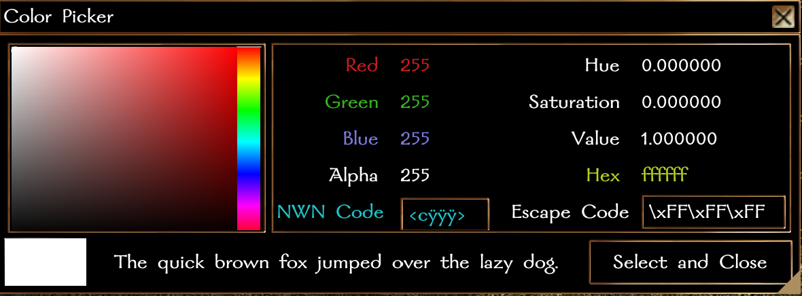

#### **NUI System Formfile: Color Picker**

- [Compatibility](#compatibility)
- [Version History](#version-history)
- [Usage](#usage)
    - [Basic](#basic)
    - [Advanced](#advanced)
    - [Configuration Options](#configuration)

### Requires:

NWN >= 8193.34.1
NUI >= 0.2.2

### Version History:

## 0.1.1:
- Added NWN Color Codes and Hex Color Code displays, both copiable by selection.

## 0.1.0:

Initial Release

### Usage:

`NUI_DisplayForm(oPC, "color_picker");`

### Configuration

In `nui_c_colorpick.nss`, set the value of `COLOR_VARNAME` to the module variable name to set the selected color's json object to.  See comments in `nui_c_colorpick.nss`.
