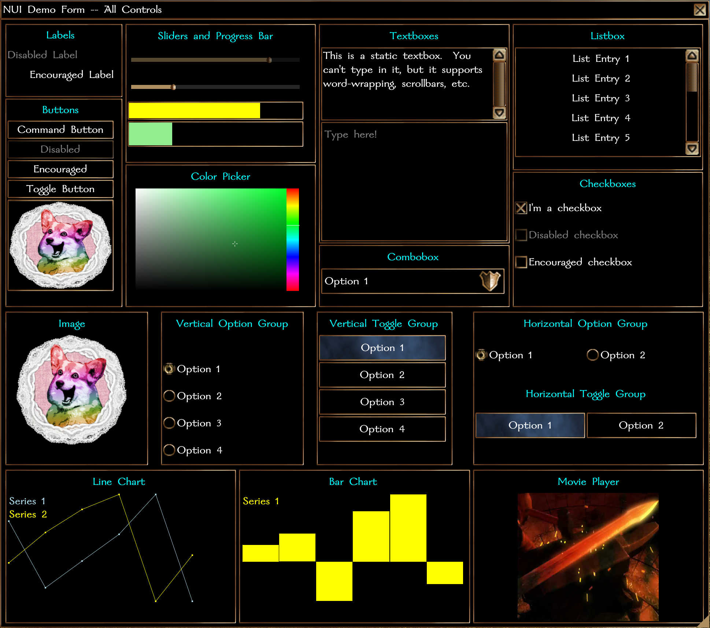

#### **NUI System Formfile: Demo**

- [Compatibility](#compatibility)
- [Version History](#version-history)
- [Usage](#usage)
    - [Basic](#basic)
    - [Advanced](#advanced)
    - [Configuration Options](#configuration)

### Requires:

NWN >= 8193.35
NUI >= 0.2.2

### Version History:

## 0.1.1:
- Modified bind function for late-binding methodology in NUI 0.2.2.

## 0.1.0:

Initial Release

### Usage:

Nothing special here.  This is just a form that displays all available NUI controls.

### Configuration

None required.
