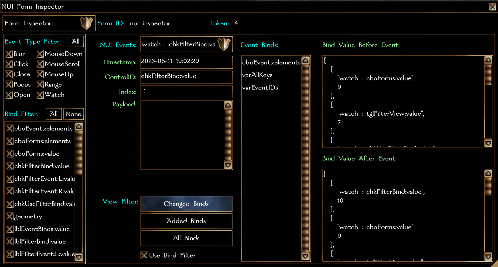

#### **NUI System Formfile: Form Inspector**

- [Compatibility](#compatibility)
- [Version History](#version-history)
- [Usage](#usage)
    - [Basic](#basic)
    - [Advanced](#advanced)
    - [Configuration Options](#configuration)

### Requires:

NWN >= 8193.35
NUI >= 0.3.0

### Version History:

## 0.1.1:
- Fixed comparison typo in `HandleModuleEvents()`.

## 0.1.0:

Initial Release

### Usage:

`nui_f_inspector` is an advanced usage form.

The inspection form can be opened with `NUI_DisplayForm(oPC, "nui_inspector");`.  There is only a single default profile as this form is designed for debug/admin use.  

*** WARNING *** Using the inspection capability is very expensive.  Each form event or bind change can result in several campaign database calls, which are inherently slow.  

To use, once the form is open, select a form from the combobox in the upper-left corner.  If a new form is opened while the inspection form is open, that form will be automatically added to the combobox drop down and can be selected immediately after the form is open.

After a form is selected, the events combobox will be populated with all events associated with the selected form.  The combobox can be filtered using the filter checkbox on the left side of the form.  If an event is deselected, all events of that type are filtered out.  If a bind is deselcted, any event associated with that bind is filtered out.

Once an event is selected, associated data is displayed on the right side.  Bind values can be viewed in a before/after format by selecting the bind from the bind list.  Additionally, you can filter the bind list the "View Filter" toggle buttons to view only changed binds, added binds, or all binds.

### Configuration

The base NUI system contains a new configuration option in `nui_c_config`.  Set `NUI_FI_RECORD_DATA` to `NUI_FI_NEVER` to prevent data recording, `NUI_FI_ALWAYS` to always keep data while forms are open, or `NUI_FI_WHEN_OPEN` to only record form data when the `nui_inspector` is open.
