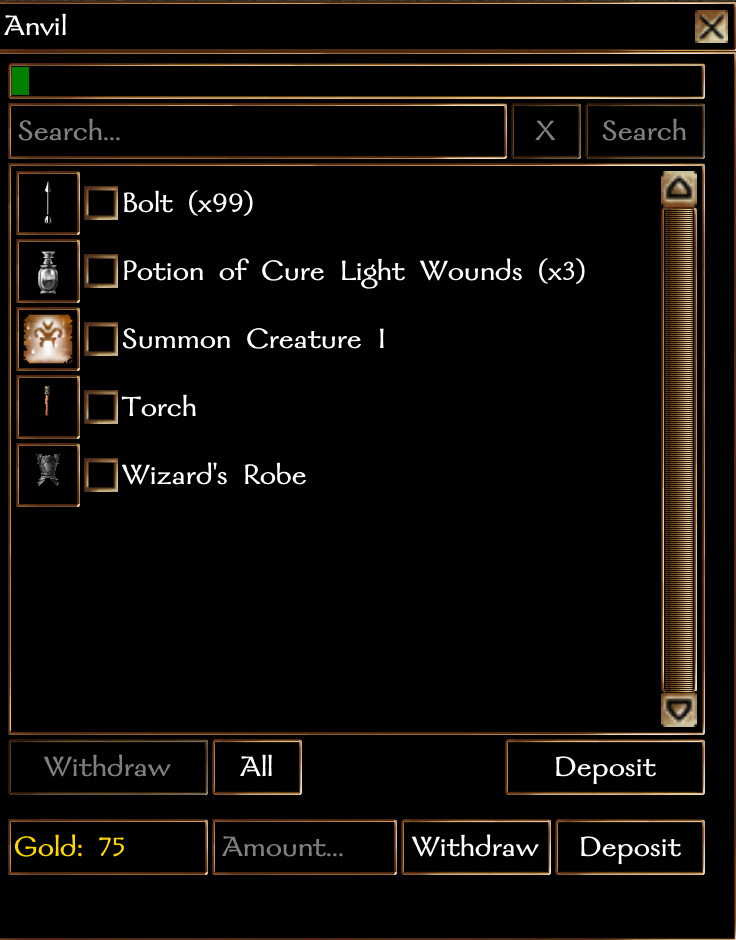

#### **NUI System Formfile: Persistent Storage**

- [Compatibility](#compatibility)
- [Version History](#version-history)
- [Usage](#usage)
    - [Basic](#basic)
    - [Advanced](#advanced)
    - [Configuration Options](#configuration)

### Requires:

NWN >= 8193.34.1
NUI >= 0.2.3

### Version History:

## 0.2.2:
- Modify item name processing to allow proper display of characters containing various accent marks.

## 0.2.1:
- Move global `sQuery` and `sql` variables into local scope to prevent conflicts with custom user formfiles.

## 0.2.0:
- BREAKING CHANGE:  This modification requires an addition to `nui_c_storage`, so be sure to copy over
all of your current configuration values to the new `nui_c_storage`.
- Added ability to use items as persistent storage containers.  The item must have the `Cast Spell: Unique Power (Self-Only)` property on it.  If you're using the NUI system's event handler, add `NUI_HandleEvents(GetItemActivator());` to the event handler for `OnActivateItem`.  This can also be called from a tag-based script in the same way.  If you are calling the formfile directly, you can achieve the same result by calling `ExecuteScript("nui_f_storage", GetItemActivator());` (if you're using pre-compiled formfiles).  The item's tag must be unique, but multiple players can have the same item while still keeping persistent inventories separate.  Persistent storage items can have all persistent storage variables set as with any other object, and will use the same defaults if those variables are not set.  Gold storage is disabled for all persistent storage items.
- Added `PS_CONTAINER_ITEM_TYPE_DEFAULT` configuration option.  Container type assignment precedence is `PS_CONTAINTER_TYPE` variable set on the object, `PS_CONTAINER_ITEM_TYPE_DEFAULT` (if the object is an item), `PS_CONTAINER_TYPE_DEFAULT`.

*** WARNING *** `nui_f_storage` should not be set as the event handler for the module's `OnActivateItem` event.  If this is set, every activated object in the game will be considered a persistent storage object.  Calling the NUI event handling system (via `NUI_HandleEvents()`) or invoking the form directly (via `ExecuteScript()`) should only be done after you have confirmed the item is a valid persistent storage item.

## 0.1.12:
- Modified `nui_f_storage` to use automatic bind watching.  This ups the NUI requriement to 0.2.3.

## 0.1.11:
- Added `BindForm()` option to pass binds as json values.  This ups the NUI requirement to 0.2.2.

## 0.1.10:
- Added ability to store and restore color-coded item names.  Previously, color-coded item names causes the item names of all stored items to be blank.  Now, the color-coding will be stripped when saved into a container, but will be restored upon withdrawal.

## 0.1.9:
- Modified item listbox to be sorted alphabetically, then by base item type, instead of the previous base item type, then alphabetical.
- Temporarily modified the form definition and item update functions to account for an NUI listbox limitation present in .34.  Original behavior will be restored once .35 is stable.  There only discernable visual effect is that that listbox now scrolls back to the top every time an item or gold is added or removed.
- Modified container item checking behavior to ensure storage of container items complies with settings in `nui_c_storage`.

## 0.1.8:
- Search terms for item searching are now case insensitive.
- Fixed `PS_FORCE_SEARCH_BUTTON_DEFAULT` configuration option behavior bug.
- Fixed `PS_FORCE_OBJECT_STATE_DEFAULT` configuration option behavior bug.
- Fixed `PS_OPEN_INVENTORY_DEFAULT` configuration option behavior bug.
- Fixed container item storage logic which did not honor `nui_c_storage` container item settings.

## 0.1.7:
- Fix search button configuration behavior.

## 0.1.6:
- Fixed tooltip for the deposit gold command button to display the maximum amount available to deposit.  It will not display the minimum of the amount of gold the PC currently has or the difference between the maximum gold a container can store and how much is currently stored in the container.

## 0.1.5:
- Fixed a gold duplication bug which only occurred when an item had already been deposited into the chest.  Thanks to @Chodezilla for finding the way to duplicate this bug. 

## 0.1.4:
- Forced gold withdraw and deposit button tooltips to update more often to prevent out-of-sync condition.
- Added gold withdraw/deposit functionality:
    If the `Amount...` textbox is empty, clicking the gold `Withdraw` button will withdraw all gold up to the amount listed in the `Gold:` container.  If there is no gold stored in the container, the gold `Withdraw` button will be disabled.  Similarly, clicking on the gold `Deposit` button will deposit all gold up to the amount the PC has, as long as it doesn't exceed the total storage capability of the container as defined by `nui_c_storage` or local override variables set on the container object.  If the PC has no gold, the gold `Deposit` button will be disabled.

## 0.1.3:
- Fixed typo in PS_CONTAINER_TYPE that prevented local overrides from reading correctly.

## 0.1.2:
- Fixed bug in sqlite query when using containers as personal storage (by character/by cdkey) which prevented the item list from displaying after an item was deposited.

## 0.1.1:

- Added configuration option: `PS_MAX_CONTAINER_ITEMS_DEFAULT`.
- Added configuration option: `PS_MAX_CONTAINER_ITEMS_INVENTORY_DEFAULT`.
- Modified available values and settings for various default settings and overrides due to the way local variables are handles by the game engine.  ***This could be a breaking change*** if local variables are used to control access.  To fix:

    `PS_STORAGE_DEFAULT` and `PS_STORAGE_LIMIT` should be set to `PS_UNLIMITED` in `nui_c_config` or `-1` if set as a variable (instead of the previous 0) to allow unlimited item storage.

    `PS_DISTANCE_DEFAULT` and `PS_DISTANCE` should be set to `PS_UNLIMITED` in `nui_c_config` or `-1.0` if set as a variable (instead of the previous 0.0) to allow unlimited distance between the player and the container.

    `PS_MAX_GOLD_DEFAULT` and `PS_MAX_GOLD` should be set to `PS_NONE` in `nui_c_config` or `-2` if set as a variable (instead of the previous 0) to prevent any gold storage.  Set to `PS_UNLIMITED` in `nui_c_config` or `-1` if set as a variable for unlimited gold storage.

- Changed configuration constant `PS_STORAGE_DEFAULT` to `PS_STORAGE_LIMIT_DEFAULT`.
- Changed configuration constant `PS_SEARCH_BUTTON_DEFAULT` to `PS_FORCE_SEARCH_BUTTON_DEFAULT`.
- Changed configuration constant `PS_OBJECT_STATE_DEFAULT` to `PS_FORCE_OBJECT_STATE_DEFAULT`.
- Changed configuration constant `PS_ACCESS_DEFAULT` to `PS_ACCESS_TYPE_DEFAULT`.
- Changed configuration constant `PS_CONTAINER_DEFAULT` to `PS_CONTAINER_TYPE_DEFAULT`.
- Added configuration constant `PS_NONE (-2)`.
- Added configuration constant `PS_UNLMITED (-1)`.
- Added configuration constant `PS_TRUE (1)`.
- Added configuration constant `PS_FALSE (-1)`.
- Added configuration constant `PS_UNLIMITED_DISTANCE (-1.0)`
- Updated `nui_c_config` constant descriptions for added configuration constants and clarity.

## 0.1.0:

Initial Release

### Usage:

The persistent storage formfile requires two scripts:  `nui_c_storage`, which contains all configuration defaults, and `nui_f_storage`, which contains the formfile's functionality.  Do not make any changes to `nui_f_storage`.  All constants in `nui_c_storage` can be changed per the module builder's desires, however, the actual configuration constant names should not be changed.

In addition to the event calls required for the base NUI system, the following are required for the persistent storage form to function correctly:
- The module's handler for `OnPlayerTarget` must include `NUI_HandleEvents(GetLastPlayerToSelectTarget());`.

To primary method to instantiate the persistent storage form for any container is to set `nui_f_storage` as the event handler for the following events on each container that will be part of the system:
- OnPlaceableUsed
- OnPlaceableOpen
- OnPlaceableClosed

Alternately, the form can be opened via calls from event handling system.  To instantiate the persistent storage form for any container from an event handler.  Once the container is verified as part of the system (through whatever method is deemed appropriate by the module builder), the following should be called:
- In the `OnPlaceableUsed` handler: `NUI_HandleEvents(GetLastUsedBy());`
- In the `OnPlaceableOpen` handler: `NUI_HandleEvents(GetLastOpenedBy());`
- In the `OnPlaceableClosed` handler: `NUI_HandleEvents(GetLastClosedBy());`
> Only one opening handler is required, either `OnPlaceableUsed` or `OnPlaceableOpen`.  Setting both will cause the form to open, immediately close and then open again.  Although this action may not be readily apparent, it can eat up valuable resources in large modules.

### Configuration

`nui_c_storage` contains all of the configuration options available for this formfile.  The values set for each configuration option in `nui_c_storage` are default values that will be used for any container that does not have a local override set.  To set a local override, set a local variable (int, float or string, depending on the configuration option) to a valid value as listed in the description for each configuration option.
