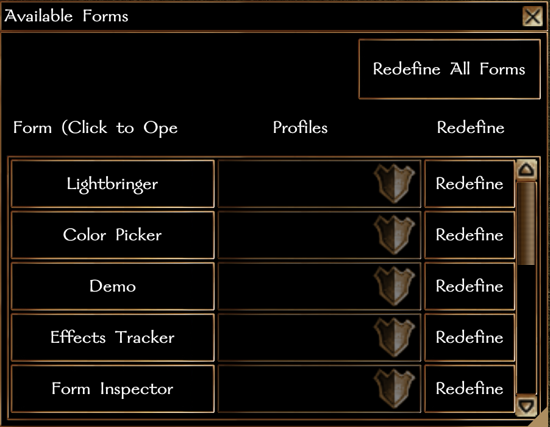

#### **NUI System Formfile: Table of Contents**

- [Compatibility](#compatibility)
- [Version History](#version-history)
- [Usage](#usage)
    - [Basic](#basic)
    - [Advanced](#advanced)
    - [Configuration Options](#configuration)

### Requires:

NWN >= 8193.34.1
NUI >= 0.2.2

### Version History:

## 0.1.3:
- Modify default profile geometry.
- Modify listbox template properties to make resizing more palatable.

## 0.1.2:
- Debug bind errors.

## 0.1.1:
- Minor updates to background control names.  No obvious usage changes.

## 0.1.0:

Initial Release

### Usage:

`NUI_DisplayForm(oPC, "toc");`

### Configuration

None required.

### Notes

This form will list all forms that have been loaded into the module as long as the form as included `NUI_SetTOCTitle()` during the form definition process in the `DefineForm()` function. The `Profiles` comboboxes are currently inoperative awaiting a bugfix in the base game handling of comboboxes inside listboxes when the options are different for each combobox.  This form is very useful for debugging forms in development because it allows live-reloading of the form definition with the `Redefine` button for the associated form.
